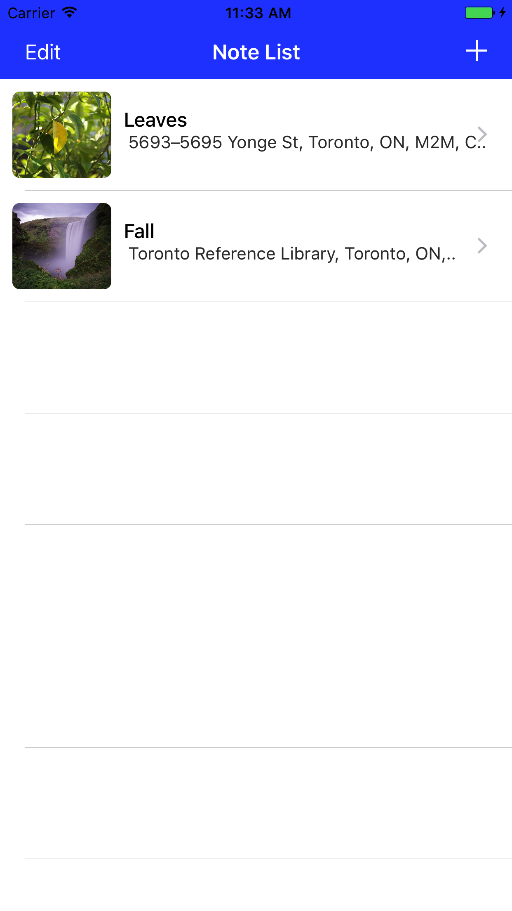
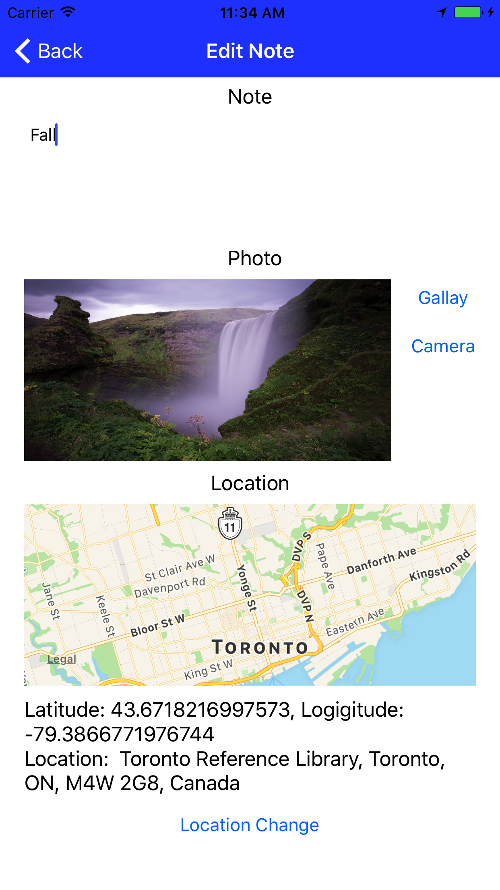
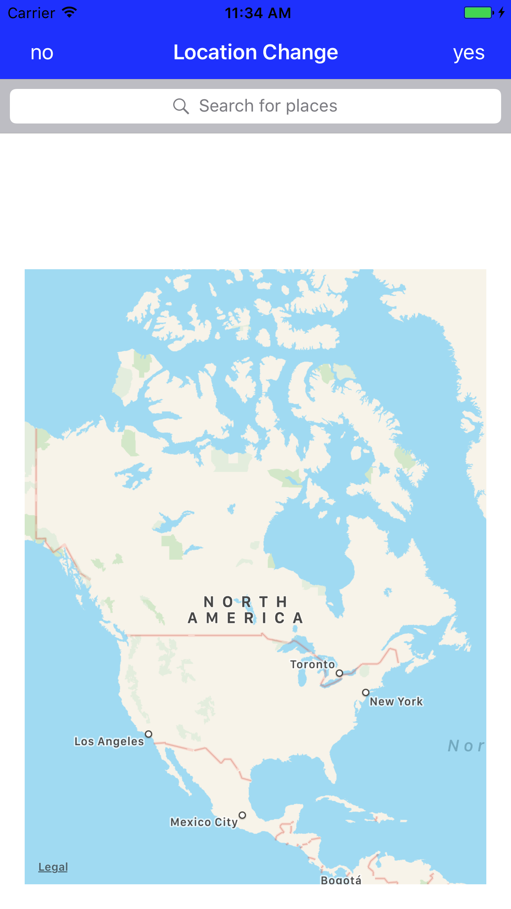
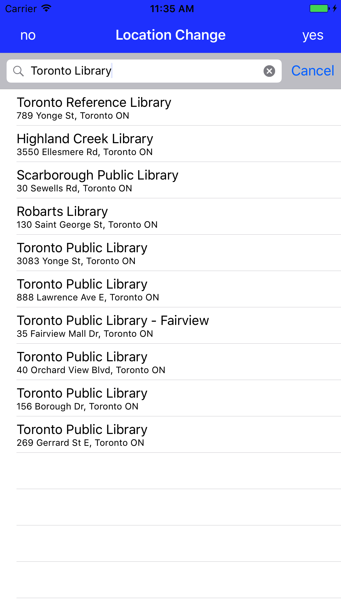
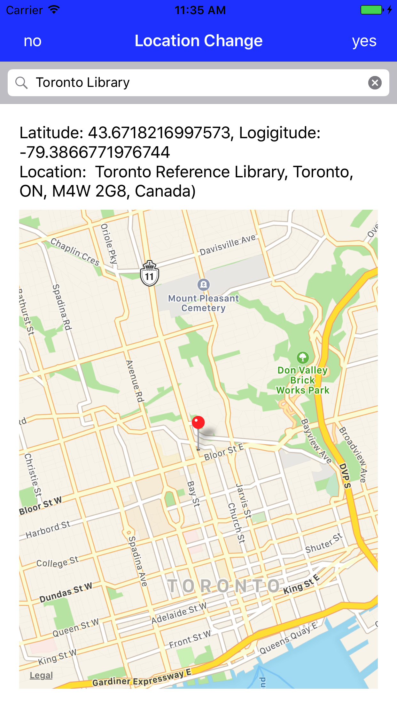

# Project Name : NoteIOSApp

## Features

This is a personal project for implementing a note iOS app. with a photo and location information  

- Note List with Add / Edit (Delete)
- Add a Photo from Gallay or Camera to a Note
- Add Location Information to a Note
- Save a Note to a SQLLite DB

## Screenshot

  
  
  
  
  

## References

FMDB (https://github.com/ccgus/fmdb)
